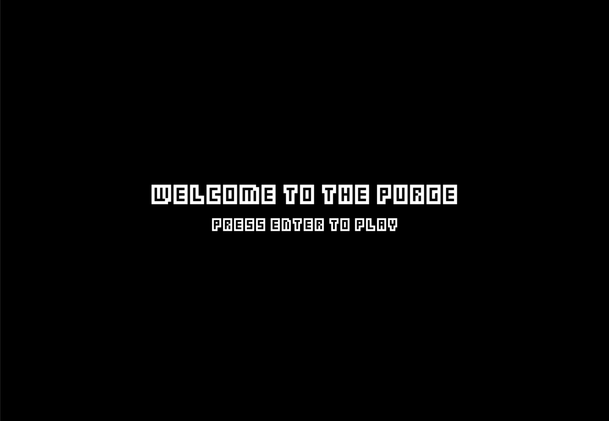
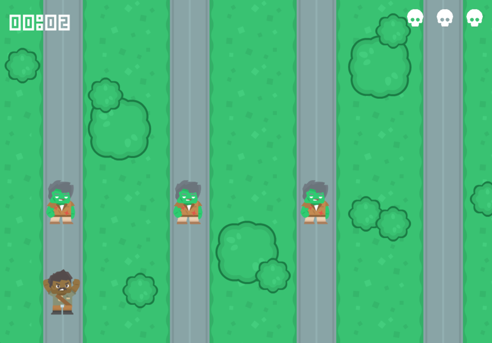
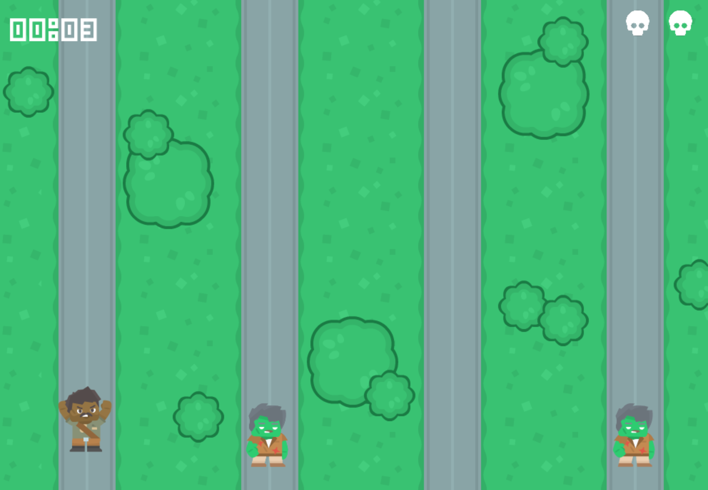
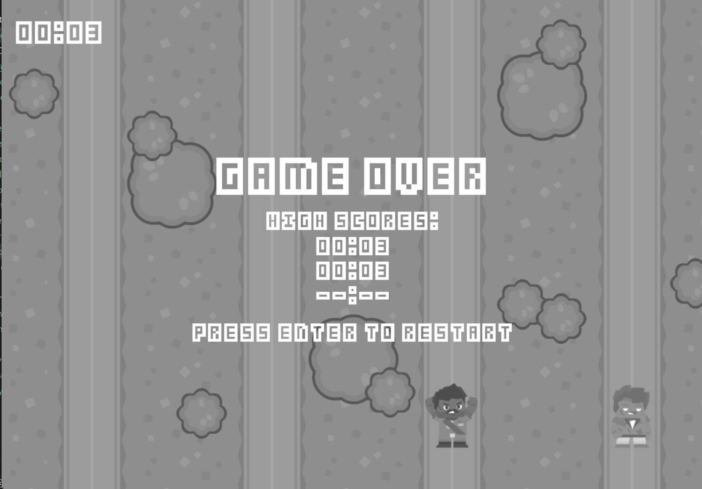

## Purge Game

### Title screen:

### Screenshot of current game:

###### Zombies spawn into random lanes and travel down y axis to "attack" character

###### If character collides with zombie, then life count goes down

### Game over screen:

- [x] Make a background
- [x] Make main warrior player character
- [x] Create zombie enemies and zombie group
- [x] Randomly spawn in zombies
- [x] Life count
- [x] Store high scores and display when character dies

## Directions
1. Run the game by pressing `enter`
2. Use the `right arrow` and `left arrow` keys to move the character and avoid the zombies
3. If dead, press enter to restart game
4. Beat the displayed high scores!